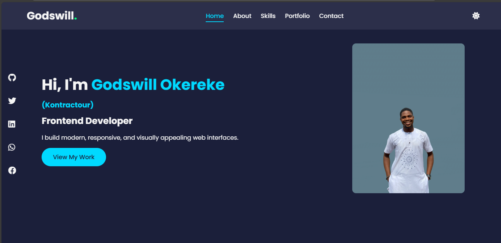
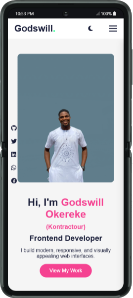

# 💼 Kontractour Portfolio


A **modern, responsive personal portfolio website** designed to showcase my skills, projects, and professional journey.  
This site reflects my growth as a **Frontend Developer** and will continue to evolve as I learn and build more.

---

## 🧭 Table of Contents
- [📜 Overview](#-overview)
- [🧱 Built With](#-built-with)
- [⚙️ Features](#️-features)
- [💻 Portfolio Section](#-portfolio-section)
- [📷 Screenshots](#-screenshots)
- [🚀 Live Demo & Repository](#-live-demo--repository)
- [🧭 How to Run Locally](#-how-to-run-locally)
- [🌱 Future Improvements](#-future-improvements)
- [👨‍💻 Author](#-author)

---

## 📜 Overview

This **Portfolio Website** highlights my background, technical skills, and featured projects.  
It’s fully responsive, fast-loading, and user-friendly — optimized for both mobile and desktop users.  
Every section is animated and visually engaging while maintaining simplicity and accessibility.

---

## 🧱 Built With

- **HTML5** — semantic and accessible structure  
- **CSS3** — responsive layouts using Flexbox and Grid  
- **JavaScript (ES6)** — interactivity and theme logic  
- **Font Awesome** — for modern icons  
- **Google Fonts** — for typography consistency  

---

## ⚙️ Features

✅ Sticky header and active navigation highlight  
✅ Dark/Light mode toggle (saved via localStorage)  
✅ Drop animations for sections  
✅ Responsive project grid (adjusts across all screens)  
✅ Projects with image, title, summary, tools used & live demo button  
✅ Social links open in new tabs  
✅ Contact section with mail and phone icons  

---

## 💻 Portfolio Section

Each project card displays:
- **Preview Image**
- **Project Name**
- **Short Description**
- **Live Demo Button**
- **Tools Used** (e.g., HTML, CSS, JS)

The layout adapts automatically:
- 3 or more projects per row on desktop  
- 2 per row on tablets  
- 1 or 2 per row on small screens  

---

## 📷 Screenshots

| Desktop View | Mobile View | Tablet View |
|---------------|--------------|--------------|
|  |  |  |

---

## 🚀 Live Demo & Repository

🌐 **Live Website:**  
```
https://kontractour.github.io/portfolio/
```

💾 **GitHub Repository:**  
```
https://github.com/Kontractour/portfolio
```
---

## 🧭 How to Run Locally

1. **Clone this repository**
   ```
   bash

   git clone https://github.com/Kontractour/portfolio.git

Navigate into the project folder

```
bash

cd portfolio
```
Open `index.html` in your browser.

---

## 🌱 Future Improvements

Here are key updates I plan to implement as the portfolio grows:

**🔹 Short-Term Goals**
- Add more detailed project cards with real deployed links

- Include project categories (Frontend, Writing, Cybersecurity, etc.)

- Improve accessibility (ARIA labels, keyboard navigation)

- Add smooth scroll animations for better UX

**🔹 Mid-Term Goals**
- Integrate a contact form with email API (Formspree / EmailJS)

-  Add a blog section powered by Markdown or CMS

- Implement a project filtering system (e.g., by tech or type)

**🔹 Long-Term Goals**
- Migrate to a framework (React or Next.js)

- Add backend support for contact and newsletter features

- Host versioned updates for different stages of my growth

- Integrate Google Analytics for visitor insights

---

## 👨‍💻 Author
**Godswill Okereke**

Frontend Developer & Content Writer

- 🌐 [LinkedIn](https://www.linkedin.com/in/godswill-okereke-3ba33b37a)
- 💻 [GitHub](https://github.com/Kontractour)
- 🔗 [Twitter](https://x.com/Kontractour)

---
```
“Built with clean code, creativity, and consistent improvement in mind.” ✨
Don't forget to star and follow.
```